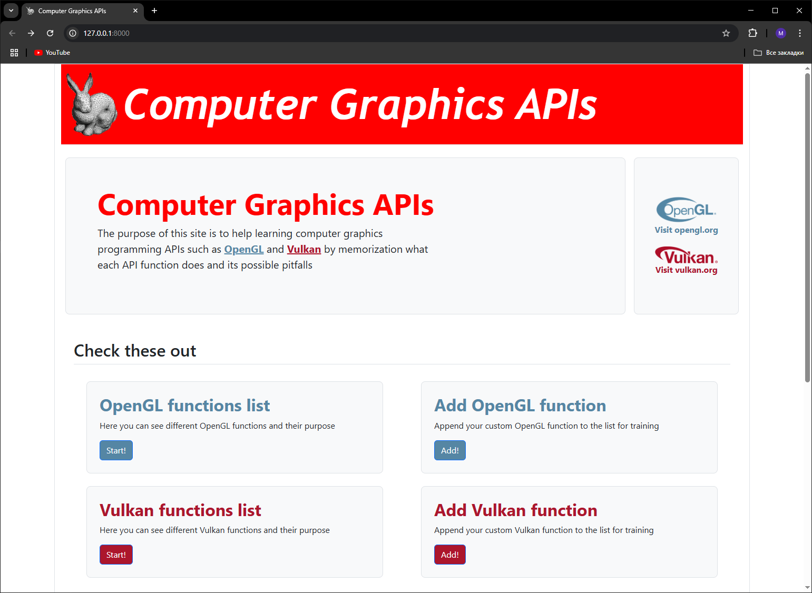

# Python Django Project
## This repository contains code of MIPT python course project
## It is about database, documentation and helpers of modern computer graphics programming APIs. Namely, [OpenGL](https://www.opengl.org) and [Vulkan](https://www.vulkan.org)

## How to run
### First, you need to clone the repository:
```
git clone https://github.com/OAMichael/python-django.git
```

### Navigate into the clonned directory:
```
cd python-django
```

### Create virtual environment:
```
python -m venv .env
```

### Activate virtual environment:
```
.env\Scripts\activate
```
#### Note: For Windows PowerShell you might need to set execution policy beforehand (use `Set-ExecutionPolicy RemoteSigned`)

### Install dependencies:
```
pip install -r requirements.txt
```

### Perform migration of the database
```
python manage.py migrate
```

### Load initial data from fixture into the database (<span style="color:rgb(64, 255, 74); font-weight: bold">optional</span>):
```
python manage.py loaddata fixtures/initial.json
```

### Run server (for example, on localhost):
```
python manage.py runserver --insecure
```

### Navigate to browser and type localhost address (http://127.0.0.1:8000):



## Check code with pylint
### One can run pylint to check code quality:
```
pylint --load-plugins=pylint_django --django-settings-module=computer_graphics.settings computer_graphics/*.py
```
